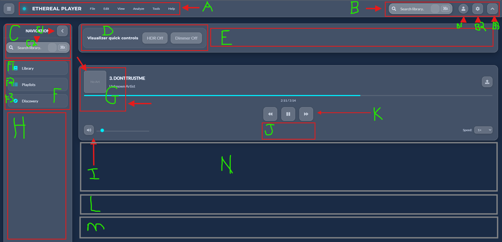

# Ethereal Player — TODO (A → N)

## Follow your checklist



Here’s a focused, Copilot‑ready **`TODO.md`** to take the Ethereal Player screenshot (A→N) to a 100% workable MVP. I’ve mapped each callout to concrete work items (files, state, a11y, acceptance). Tech stack is React 18 + TypeScript + Vite, Zustand stores, Three.js visualizer, Framer Motion, glass tokens, WCAG AA.

---

> Goal: land a fully working, keyboard‑accessible MVP that can load local files + HTTPS/HLS streams, play, seek, control volume, show album art + metadata, search library, and expose minimal visualizer + settings.
> Performance bar: 55–60 FPS on Tier‑2 hardware.
> Accessibility: full keyboard support, visible focus ring, correct ARIA.

---

## 0) Global prep (one‑time)

* [x] Ensure design tokens and globals are loaded early:

  * `src/styles/tokens.css`, `src/styles/globals.css`
* [x] Confirm core stores with persist:
  * `src/lib/state/usePlayerStore.ts`, `useVizStore.ts`, `useSettingsStore.ts`, `useUIStore.ts`  <!-- Zustand store rewrite complete 2024-08-24 -->
...

  * `src/lib/state/usePlayerStore.ts`, `useVizStore.ts`, `useSettingsStore.ts`, `useUIStore.ts`
* [x] Core audio modules:

  * `src/lib/audio/AudioEngine.ts`, `PlaybackController.ts`, `TrackLoader.ts`, `AnalyserBus.ts`
* [x] MediaSession + hotkeys:

  * `src/lib/utils/MediaSession.ts`, `src/lib/utils/Hotkeys.ts`
* [x] Error boundaries, toasts:

  * `src/components/feedback/ErrorBoundary.tsx`, `Toasts.tsx`
* [x] Icon registry is stable:

  * `src/lib/utils/IconRegistry.ts`

**Acceptance (global)**
Cold start < 2s on desktop Chrome. Tab order: TopBar → SidePanel → PlayerCard controls. Focus ring visible everywhere. Space/Enter work on player controls. Media keys work.

---

## A) Main logo + menu (Top app menu)

**Where**: `src/components/layout/TopBar.tsx` (+ `AppShell.tsx`)
**Problem**: Menu exists but items don’t do anything.

## **Tasks**

* [x] Replace static “File / Edit / View / Analyze / Tools / Help” with an **Action Menu** component:

  * `src/components/layout/MenuBar.tsx`
  * Backed by `useUIStore` with a type‑safe command registry.
* [x] Implement these MVP commands:

  * File → “Open Files…” (opens Import dialog), “Open Stream URL…”
  * View → “Toggle Side Panel”, “Toggle Visualizer”
  * Analyze → “Stream Test Wizard”, “Diagnostics Overlay”
  * Tools → “Export Playlist (M3U/JSON)”
  * Help → “What’s New”, “Keyboard Shortcuts”
* [x] Menu items use `<button role="menuitem">` with roving tab‑index, Arrow navigation, Esc to close.
* [x] Add Framer Motion press/ripple micro‑interactions.

### **Acceptance**

* Keyboard: Alt/Option opens first menu, arrows navigate, Enter activates. Esc closes.
* Commands dispatch to `useUIStore.getState().openDialog('import')`, etc.
* Focus trap inside open menu.

---

## B) Search bar, Profile (B1), Settings (B2), Collapse carrot (B3)

**Where**: `TopBar.tsx` + new dialogs

### B (Search)

* [x] Implement a single debounced search input (shared with C1):

  * `src/components/library/SearchBar.tsx`
  * Store query in `useSettingsStore().searchQuery` with 250ms debounce.
* [x] On submit, focus moves to Library list region and filters visible list.

**Acceptance**
Typing filters TrackList/Playlists instantly; Screen reader: `aria-label="Search library"`; `Ctrl+F` focuses search.

### B1 (Profile glass modal)

* [x] Create `src/components/profile/ProfileModal.tsx` (glass card):

  * Upload avatar (local image → persisted in IndexedDB/LocalStorage).
  * Display name, short bio, theme preference (mirrors Settings theme).
  * Buttons: Save, Reset, Close.
* [x] Use `<dialog role="dialog" aria-modal="true" aria-labelledby="profile-title">`.
* [x] Image picker with drag‑drop + click, live preview, size/type validation.

**Acceptance**
Open via clicking avatar; avatar updates instantly in TopBar; state persists across reload; full keyboard trap.

### B2 (Settings)

* [x] Create `src/components/settings/SettingsModal.tsx` with tabs:

  * General: Theme (dark/system), Density, Language (future‑proof), What’s New.
  * Audio: Output device picker, Volume limiter toggle, EQ Preset selector.
  * Visualizer: Intensity, Bloom cap, Motion scale, HDR toggle (opt‑in).
  * Storage: Cache meter + Purge button (artwork + metadata cache).
  * Privacy: Telemetry consent (opt‑in), export anonymous diagnostics.
* [x] Wire to `useSettingsStore` and sub‑stores.
* [ ] Add `Cmd/Ctrl+,` shortcut.

**Acceptance**
All switches persist; Output device changes route audio; Purge clears cache and shows toast; focus trap + Esc close.

### B3 (Top bar collapse carrot → “Unlockable Panels”, Phaseable)

* [x] MVP: clicking B3 collapses the **TopBar** height.
* [ ] Phase 1.1 roadmap: **Panel Layout Manager**

  * `src/lib/ui/LayoutManager.ts` tracks regions (TopBar, SidePanel, PlayerCard info, Lists L/M/N).
  * Each region supports: collapse/expand, size presets (S/M/L), and grid slot reassignment.
  * Animation with Motion; snap points; store persisted in `useUIStore`.

**Acceptance (MVP)**
Click B3 shrinks/expands TopBar; contents reflow without overlap; keyboard toggle with `T`.

---

## C) Left sidebar (search C1 + carrot C2)

**Where**: `SidePanel.tsx`

* [ ] C1 is the **same shared search** component as B, bound to the same store.
* [ ] C2 mirrors B3 behavior but for SidePanel:

  * MVP: collapse/expand panel with animation; remember last width.
  * Phase 1.1: register with Layout Manager to make it unlockable/resizable.

**Acceptance**
Search remains in sync with TopBar search; SidePanel collapses/expands; `[` and `]` hotkeys resize S/M/L.

## D) Visualizer quick controls (HDR Off, Dimmer Off)

**Where**: `components/visualizer/HdrToggle.tsx`, `DimmerToggle.tsx`, `PresetSelector.tsx`

* [x] Wire HDR toggle to visualizer params (`useVizStore.params.hdrEnabled`), guarded by capability check.
* [x] “Dimmer” = post‑exposure/bloom cap reducer (e.g., sets `bloom` max to 0.25 and lowers exposure).
* [x] Add **Preset** quick switcher (Nebula / Glass Waves / Strobe Pulse).
* [x] Persist toggles; show tooltips; include reduced‑motion guard.

**Acceptance**
Toggles produce visible, smooth changes at 55–60 FPS. Reduced motion mode clamps movement. Toggle states persist.

---

## E) Empty strip (Session Utility Row)

**Session Utility Row** (always useful, light footprint):

* [x] Mini now‑playing summary (title • artist • duration), click focuses PlayerCard.
* [ ] **Hotkeys cheat** button (opens a tiny popover).
* [x] **Performance chip** (FPS tier Medium/High and live FPS number).
* [x] **Queue size chip** (e.g., “Queue: 23” → opens the queue).
* [ ] Phase 1.1: voice search mic button (disabled if mic blocked).

> The mini now-playing summary, FPS chip, and queue size chip are now fully wired to real state and styled via CSS module. All values update live as playback and performance change.

**Acceptance**
Everything is read‑only except the two buttons; row never steals focus during typing.

---

## F) Library (F1), Playlists (F2), Discovery (F3)

**Where**: `components/library/*`, `components/playlistTools/*`

* [ ] F1 Library: `LibraryView.tsx` with `TrackList.tsx` (windowed/virtualized).
  Source = `usePlayerStore().library`, filtered by `searchQuery`.
* [ ] F2 Playlists: `PlaylistList.tsx` + basic CRUD in `usePlayerStore` (`createPlaylist`, `addToPlaylist`, `removeFromPlaylist`).
* [ ] F3 Discovery (MVP local‑first): “Smart crates” that auto‑filter:

  * Recently added, Most played, Not played yet.
  * Future: optional remote modules (leave stubs).

**Acceptance**
Library of 1k tracks stays 60 FPS while scrolling; creating a playlist works; Discovery lists update live.

---

## G) Album art + metadata (and size increase)

**Where**: `components/player/AlbumArt.tsx`, `TrackInfo.tsx`, `TrackLoader.ts`

* [ ] **Embedded metadata**: integrate `music-metadata-browser` in `TrackLoader.ts` to parse ID3/MP4/FLAC and extract:

  * `title`, `artist`, `album`, `duration`, `picture` → Blob URL for `artworkUrl`.
  * Sanitize strings before rendering.
* [ ] **Fallback metadata fetch (phaseable)**:

  * V1: strictly local; V1.1: optional MusicBrainz/AcoustID lookup behind a **Settings → Privacy** toggle.
* [ ] **Art size**: enlarge art container to the red‑boxed target; maintain 1:1 aspect, object‑fit: cover.
* [ ] **Palette extraction** (web worker) to tint UI accents (subtle).

**Acceptance**
Local files show title/artist/album/art without UI freeze; large art renders crisp; bad tags don’t break UI.

---

## H) Empty left column (proposal)

Pick one (MVP) + leave others for 1.1:

* [ ] **Now Playing Queue** (recommended MVP): draggable reorder, “remove from queue”.
* [ ] Small **History** list of recent tracks.
* [ ] **Pinned filters** (chips) for quick library slicing.

**Acceptance**
Queue reorder updates currentIndex correctly; keyboard drag via buttons (Move up/down).

---

## I) Volume control (currently not wired)

**Where**: `components/player/VolumeSlider.tsx`, `AudioEngine.ts`

* [ ] Connect slider → `usePlayerStore.volume` (0–1), update master `GainNode` in AudioEngine.
* [ ] Include **mute** button (`M` shortcut) and screen reader live region “Volume 65%”.
* [ ] Mouse, touch, and keyboard (Left/Right=1%, Up/Down=5%) work. Value text visible on focus.

**Acceptance**
Slider changes actually change loudness with no pops; `M` toggles mute; setting persists.

---

## J) Relocate transport controls here (K moves down)

**Where**: `PlayerCard.tsx`, `TransportBar.tsx`, `PlaybackButtons.tsx`, `Timeline.tsx`

* [ ] Move controls to region J; maintain 44px touch targets.
* [ ] Group order: **Prev • Play/Pause • Next** | Repeat | Shuffle | Timeline below.
* [ ] Add “Speed” selector (1x only for MVP UI parity; implementation later is optional).

**Acceptance**
Buttons operate `PlaybackController`; Play toggles correctly; timeline scrub seeks smoothly.

---

## K) Player controls behavior (wiring + a11y)

* [ ] `PlaybackButtons.tsx` calls `play() / pause() / next() / prev()` from store/controller.
* [ ] Add ARIA:

  * Play/Pause has `aria-pressed`, accessible name reflects state.
  * Repeat cycles: off → one → all, announces via `aria-live="polite"`.
  * Shuffle toggles, announces state.

**Acceptance**
Space toggles play when any control is focused; hardware media keys work via MediaSession.

---

## L) Empty strip #2 (proposal)

## **EQ Dock (collapsed by default)**

* [ ] Add a compact EQ preset switch (Flat, Rock, Pop, Electronic), with “Open full EQ” button.
* [ ] Show small 10‑band graph preview (non‑interactive) reflecting current curve.

**Acceptance**
Switching presets applies instantly without audio clicks; dock remembers collapsed state.

---

## M) Empty strip #3 (proposal)

## **Playlist Inspector / Selection Tray**

* [ ] When user selects tracks in Library, they appear here for quick actions:

  * Add to playlist…, Remove from selection, Clear.
* [ ] Dragging into M adds to tray; keyboard accessible buttons for Add/Clear.

**Acceptance**
Selection shows count; adding to playlist creates or appends as expected; tray clears on play if desired.

---

## N) Main body panel (proposal)

## **Primary content surface — pick view based on context**

* [ ] Default: **Visualizer Canvas** behind glass panels (`WebGLCanvas.tsx`).
* [ ] When Library is active, N hosts `LibraryView` (grid or list).
* [ ] When “Queue” is focused (H), N shows queue details (optional).
* [ ] Smooth transitions with Framer Motion; never exceed 16ms per frame budget.

**Acceptance**
Switching views doesn’t stutter; webglcontextlost is handled; reduced motion respected.

---

## Import & streaming (needed for MVP)

* [ ] **Import dialog**: `components/playlistTools/ImportDialog.tsx`

  * Local files → `TrackLoader` → enqueue to library.
* [ ] **Open Stream URL dialog**: validate HTTPS, HLS handling (hls.js on Chromium, native on Safari).
* [ ] **Stream Test Wizard** (simple MVP page or dialog): URL + CORS/MIME probe, show status/toasts.

**Acceptance**
Local MP3/AAC plays. HTTPS URL plays. HLS plays on Chromium and Safari.

---

## Search plumbing (Library/Playlists/Discovery)

* [ ] Index simple fields (title, artist, album) in memory for `searchQuery`.
* [ ] Debounce; highlight matches inside rows; keyboard focus jumps to first result with Enter.

**Acceptance**
1k items filter under 30ms; no dropped frames while typing.

---

## Accessibility checklist (MVP exit)

* [ ] Visible focus ring (Radiant Aqua) with inner contrast outline on all focusable elements.
* [ ] All icons have `aria-label` or `title`.
* [ ] Dialogs: `role="dialog"`, `aria-modal="true"`, proper labelling, focus trap, Esc close.
* [ ] Lists use roving tab index; track rows expose **Play** via Enter and **More** via menu key.
* [ ] Contrast on glass meets WCAG AA; add solid‑color fallback layer if needed for compliance.
* [ ] Reduced motion: clamp heavy movement in visualizer; disable large parallax.

---

## Performance guardrails

* [ ] First‑launch probe sets device tier; visualizer caps bloom and particle count accordingly.
* [ ] Avoid React re‑renders in hot paths: selector‑based store reads, `memo`, `useCallback`.
* [ ] Lazy‑load Three.js bundle after UI is interactive.
* [ ] Artwork palette extraction off main thread (Web Worker).

**Acceptance**
Sustained 55–60 FPS with default preset; CPU/GPU stable during playback and UI interactions.

---

## File/Component Map (for Copilot)

```bash
src/
  components/
    layout/{AppShell.tsx, TopBar.tsx, MenuBar.tsx, SidePanel.tsx}
    profile/ProfileModal.tsx
    settings/{SettingsModal.tsx, ThemeControls.tsx, AudioDevicePicker.tsx, DensityToggle.tsx,
              VisualizerControls.tsx, CacheControls.tsx, TelemetryConsent.tsx}
    library/{LibraryView.tsx, SearchBar.tsx, TrackList.tsx, PlaylistList.tsx, Filters.tsx}
    playlistTools/{ImportDialog.tsx, ExportDialog.tsx}
    player/{PlayerCard.tsx, TransportBar.tsx, PlaybackButtons.tsx, Timeline.tsx,
            VolumeSlider.tsx, TrackInfo.tsx, AlbumArt.tsx}
    visualizer/{WebGLCanvas.tsx, PresetSelector.tsx, HdrToggle.tsx, DimmerToggle.tsx}
    feedback/{Toasts.tsx, ErrorBoundary.tsx}
  lib/
    audio/{AudioEngine.ts, TrackLoader.ts, PlaybackController.ts, AnalyserBus.ts, EQGraph.ts, Limiter.ts}
    three/{VisualizerScene.ts, SceneController.ts, components/{ParticlesField.ts, MistLayers.ts, PostProcessing.ts}}
    state/{usePlayerStore.ts, useVizStore.ts, useSettingsStore.ts, useUIStore.ts}
    utils/{Hotkeys.ts, MediaSession.ts, UrlGuard.ts, FocusRing.ts}
    workers/{PaletteWorker.ts}
  styles/{tokens.css, globals.css}
```

---

## QA / Playwright smoke (add later, but stub now)

* [ ] Play local file end‑to‑end: import → play → seek → pause (assert MediaSession title).
* [ ] Toggle HDR + Dimmer — assert canvas class/uniforms change.
* [ ] Search “test” filters list; Enter plays first result.
* [ ] Profile modal opens, avatar set, persists.

---

## Nice‑to‑haves queued (post‑MVP)

* Panel Layout Manager (unlockable/resizable panels with snap and persistence).
* Crossfade, gapless (engine work).
* Voice search and mic visualizer mode.
* CDN‑fetched release notes.
* Casting integrations.

---

## Design system notes (for all new UI)

* Glass tokens: `border-radius:16px; backdrop-filter:blur(16px); background:rgba(255,255,255,.12); border:1px solid rgba(255,255,255,.25)`.
* Brand colors: Deep Indigo `#1A2B45`, Soft Lavender `#7F6A9F`, Radiant Aqua `#00F0FF`.
* Typography: Montserrat (700) for titles, Lato (400) for body.
* Buttons/sliders: Framer Motion press/ripple, min touch size 44px.
* Stick to Zustand; no Context for global state.

---

### Hand‑off note to Copilot

Please implement tasks in the order above. Favor selector‑based Zustand hooks to minimize re‑renders, lazy‑load the Three.js visualizer code, and keep all dialogs fully keyboard‑operable with WCAG AA contrast on glass surfaces. Persist user‑facing preferences to `useSettingsStore` and audio/visualizer params to their respective stores.
