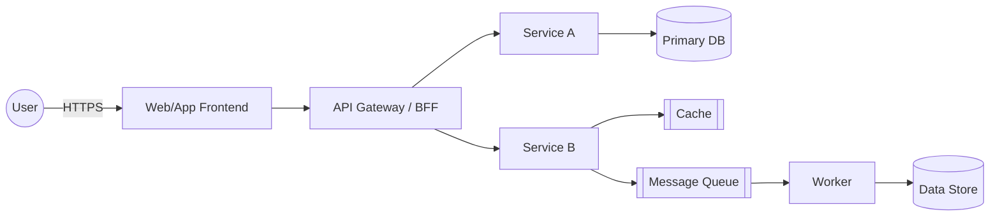
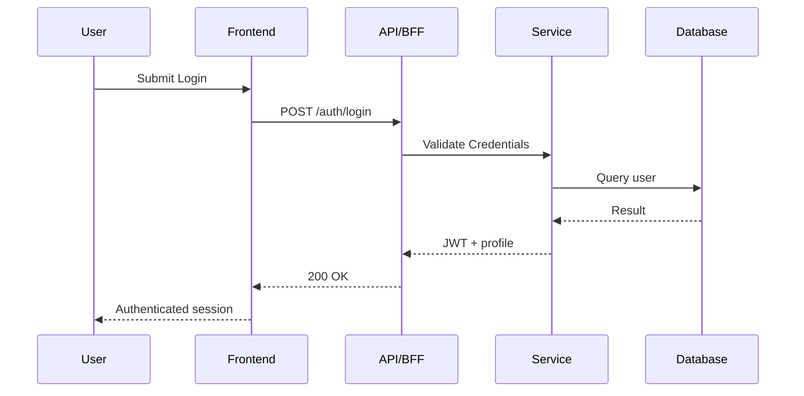
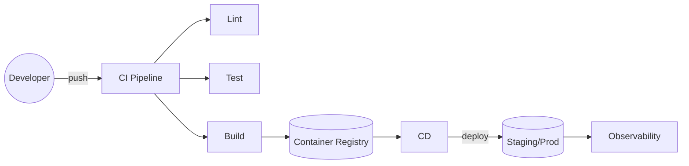
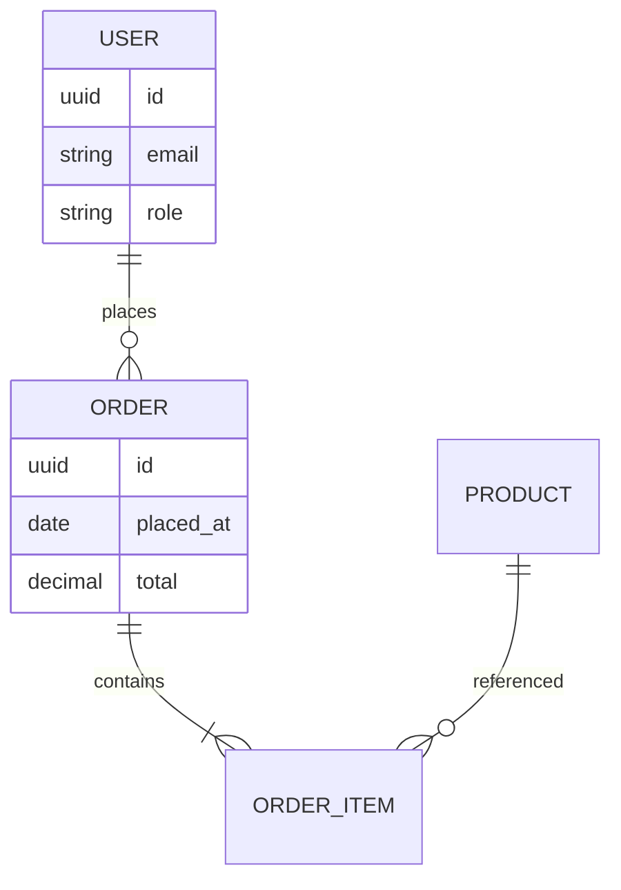

> Part of [Ethereal Harmony Documentation](./README.md)

**Quick Links**  
**Core**: [Overview](./MASTER_OVERVIEW.md) · [Roadmap](./ROADMAP.md) · [Brand](./BRAND_GUIDELINES.md) · [Glossary](./GLOSSARY.md)  
**Architecture**: [Frontend](./FRONTEND.md) · [Backend](./BACKEND.md) · [DevOps](./DEVOPS.md) · [Database](./DATABASE.md) · [API Ref](./API_REFERENCE.md)  
**Quality**: [Accessibility](./ACCESSIBILITY.md) · [Security](./SECURITY.md) · [Performance](./PERFORMANCE.md) · [Observability](./OBSERVABILITY.md) · [Test Plan](./TEST_PLAN.md) · [Workflows](./WORKFLOWS.md)  
**People**: [Onboarding](./ONBOARDING.md) · [Contributing](./CONTRIBUTING.md)  
**Deep Links**: [ADRs](./ADR) · [Diagrams](./diagrams) · [Security Reviews](./security) · [Ops/Runbooks](./ops) · [Reports](./reports) · [Images](./images/ui-overview.png)

# TODO — Full‑Stack Master Documentation & Codebase Analysis (Cursor‑Ready Template)

> Purpose: Use this checklist to drive a **comprehensive analysis of an existing codebase** and generate a **Master Documentation Set** that covers architecture, backend, frontend, data, APIs, DevOps, security, performance, and operations. It’s optimized for AI‑assisted editors (e.g., Cursor) and can be adapted to any stack.

---

## 0) Project Variables (fill these in first)

* **Project Name:** `<PROJECT_NAME>`
* **Repo URL(s):** `<REPO_URLS>`
* **Monorepo or Polyrepo:** `<MONOREPO|POLYREPO>`
* **Primary Languages:** `<TS|JS|Python|Go|Java|C#|Ruby|PHP|Rust|Swift|Kotlin|...>`
* **Frameworks:** `<React|Next.js|Vue|Nuxt|Svelte|Angular|Node|NestJS|Express|FastAPI|Django|Rails|Spring|ASP.NET|Go Fiber|...>`
* **Datastores:** `<PostgreSQL|MySQL|MongoDB|Redis|Elasticsearch|DynamoDB|SQLite|...>`
* **Messaging/Streaming:** `<Kafka|RabbitMQ|SQS|SNS|Redis Streams|NATS|...>`
* **Hosting/Cloud:** `<AWS|GCP|Azure|Vercel|Netlify|Render|Fly.io|Kubernetes|Docker Compose|Bare‑metal|...>`
* **Infra‑as‑Code:** `<Terraform|Pulumi|CloudFormation|CDK|Ansible|...>`
* **CI/CD:** `<GitHub Actions|GitLab CI|CircleCI|Jenkins|Argo|Tekton|...>`
* **AuthN/AuthZ:** `<JWT|Sessions|OAuth2|OIDC|SAML|Auth0|Cognito|Clerk|NextAuth|...>`
* **Secrets Mgmt:** `<.env|Vault|SOPS|AWS SM|Google SM|Doppler|1Password|...>`
* **Preferred Doc Site:** `<Docusaurus|MkDocs|Sphinx|ReadTheDocs|GitHub Wiki|...>`
* **Compliance Needs:** `<PII|GDPR|HIPAA|SOC2|PCI DSS|None>`

---

## 1) How to Use This Template

* Work top‑down; tick every checkbox. Keep commits small and grouped by section.
* Create a `/docs` folder at repo root unless one exists. Generate all deliverables there.
* Prefer **automated extraction** over manual writing. Where possible, produce **diagrams + SBOM + OpenAPI** from code/config.
* Use the **Cursor prompts** provided to accelerate each step. Save outputs and scripts into `/tools` and `/docs`.

---

## 2) Definition of Done (DoD)

* [ ] `/docs/MASTER_OVERVIEW.md` summarizes the entire system with links to all sub‑docs.
* [ ] Architecture diagram(s) in `/docs/diagrams` (Mermaid and/or PNG/SVG) — app‑level, service‑level, and data‑flow.
* [ ] Backend, Frontend, Data, API, Security, Observability, DevOps, and Operations docs completed (see sections below).
* [ ] **Autogenerated artifacts**: SBOM, dependency graphs, OpenAPI/GraphQL schema, database ERD, code metrics, coverage report.
* [ ] **Runbooks** for common operational tasks and incident response.
* [ ] **CONTRIBUTING.md** + **ONBOARDING.md** finalized; linters/formatters configured; CI lint/test/docs pipelines green.
* [ ] **Glossary** and **Acronyms** section for domain terms.
* [ ] All docs cross‑linked, versioned, and published (e.g., Docusaurus site or GitHub Pages) if required.

---

## 3) Global Deliverables & Structure

Create the following tree (adjust as needed):

```bash
/docs
  /diagrams
    architecture-overview.mmd
    services-context.mmd
    sequence-auth.mmd
    deployment-topology.mmd
  /reports
    sbom.json
    dependencies-graph.html
    test-coverage/index.html
    code-metrics.md
  /api
    openapi.yaml
    graphql-schema.graphql
  /db
    schema.sql
    erd.mmd
  /ops
    runbooks.md
    sops-policy.md
    backup-restore.md
  /security
    threat-model.mmd
    security-review.md
  MASTER_OVERVIEW.md
  BACKEND.md
  FRONTEND.md
  DATABASE.md
  API_REFERENCE.md
  DEVOPS.md
  OBSERVABILITY.md
  SECURITY.md
  PERFORMANCE.md
  ONBOARDING.md
  CONTRIBUTING.md
  GLOSSARY.md
  ADR/0001-record-architecture-decisions.md
```

---

## 4) Repository Discovery & Inventory

* [ ] Clone all relevant repos; capture commit history size, active branches, tags, and deployment branches.
* [ ] Generate a filesystem map:

  ```bash
  git ls-files > /docs/reports/filelist.txt
  npx --yes cloc . > /docs/reports/cloc.txt || true
  npx --yes depcruise --include-only "src|app|packages" --output-type dot src | dot -Tsvg -o /docs/reports/dependency-graph.svg || true
  ```

* [ ] Identify **entrypoints** (web servers, CLIs, workers, cron jobs, serverless handlers). Document paths and invocation commands.
* [ ] Detect **monorepo tooling**: \[ ] Turborepo, \[ ] Nx, \[ ] Lerna, \[ ] Bazel, \[ ] pnpm workspaces, \[ ] Yarn workspaces.
* [ ] Inventory build tools: \[ ] Vite, \[ ] Webpack, \[ ] esbuild, \[ ] Rollup, \[ ] Babel, \[ ] tsc, \[ ] Poetry, \[ ] pipenv, \[ ] Maven/Gradle, \[ ] msbuild, \[ ] Cargo, \[ ] Make.
* [ ] Capture **package scripts** and make a task matrix (build/test/lint/start).
* [ ] List **environment files** (`.env*`, `config/*`, `settings.*`, `application.*`). Note secret handling.
* [ ] Enumerate **feature flags** and toggles (e.g., LaunchDarkly, Unleash, homemade), default states, and risk.

### **Cursor Prompt (Discovery)**

```bash
Scan the repo(s) and produce:
1) Entrypoints list by language with file paths.
2) Detected frameworks/libraries and versions.
3) Build/test/lint/start commands from package files and CI configs.
4) Any .env or secrets patterns (do not print secrets), note how they’re loaded.
5) A candidate /docs structure tailored to this project.
Output as Markdown with tables.
```

---

## 5) Architecture & Diagrams

* [ ] Document **system context** (users, external systems, trust boundaries).
* [ ] Draw **container/service diagram** (microservices, libs, shared packages).
* [ ] Create **sequence diagrams** for critical flows: auth/login, signup, checkout, data import, scheduled jobs.
* [ ] Map **deployment topology** (regions, VPC/VNet, clusters, edge/CDN, load balancers, autoscaling).
* [ ] Capture **cross‑cutting concerns**: caching, queues, feature flags, validation, serialization, rate limits.

## **Mermaid Templates**





### **Cursor Prompt (Architecture Extraction)**

```bash
From the codebase, infer main components and interactions. Propose Mermaid diagrams for:
1) System context, 2) Service/container map, 3) One key sequence. Include file paths that support each arrow/interaction.
```

---

## 6) Backend Analysis & Documentation

* [ ] Identify backend frameworks and patterns (MVC, Hexagonal, Clean Architecture, DDD modules).
* [ ] List services, controllers, handlers, middlewares, interceptors.
* [ ] Enumerate background workers, schedulers (cron, Celery, Sidekiq, Bull), and event consumers.
* [ ] Detect configuration strategy (12‑factor), env var schema, configuration sources (files, flags, env).
* [ ] Summarize auth flows (JWT vs sessions, refresh tokens, CSRF), permission model (RBAC/ABAC), multi‑tenant handling.
* [ ] Capture validation, serialization, error handling, idempotency, retries and back‑off.
* [ ] Note performance features (connection pooling, caching, N+1 mitigations, pagination strategies).

**Deliverable:** `/docs/BACKEND.md` with code references and example requests/responses.

### **Cursor Prompt (Backend)**

```bash
Produce BACKEND.md that covers: frameworks, packages and versions; app entrypoints; middleware chain; auth/permissions; validation; error handling; background jobs; configuration (env var table); performance practices; with code path citations for each claim.
```

---

## 7) Frontend Analysis & Documentation

* [ ] Identify framework (React/Next/Vue/etc.), rendering mode (CSR/SSR/ISR/SSG), routing, state mgmt (Redux, Zustand, Vuex, Pinia), data‑fetching (SWR/React‑Query/Apollo/urql), and forms.
* [ ] Document design system (Storybook, Figma links), component library, CSS strategy (Tailwind, CSS‑in‑JS, SCSS).
* [ ] Accessibility posture (ARIA usage, keyboard nav, color contrast), i18n/l10n strategy.
* [ ] Performance: code‑splitting, image optimization, critical CSS, prefetching, caching headers.
* [ ] Error boundaries and logging; feature flags; analytics pixels/SDKs.

**Deliverable:** `/docs/FRONTEND.md` with route map, major components, data flows, and perf budget.

### **Cursor Prompt (Frontend)**

```bash
Generate FRONTEND.md with: routing tree; data fetching strategy; state stores; key components; styling approach; accessibility checklist; perf optimizations; and links to Storybook if present.
```

---

## 8) API Surface (REST/GraphQL/gRPC/Webhooks)

* [ ] Detect API types: \[ ] REST, \[ ] GraphQL, \[ ] gRPC, \[ ] Websockets, \[ ] Webhooks.
* [ ] For REST: extract OpenAPI (code annotations, routers) → `/docs/api/openapi.yaml`.
* [ ] For GraphQL: dump schema → `/docs/api/graphql-schema.graphql`.
* [ ] For gRPC: list protobufs and services; generate service list.
* [ ] For Webhooks: list topics/events, payloads, signature verification.

**Deliverables:** `/docs/API_REFERENCE.md` + generated specs.

### **Cursor Prompt (API)**

```bash
Locate all API definitions (controllers, routers, schema files) and produce:
- OpenAPI or GraphQL schema artifacts
- Endpoint tables (method/path/summary/auth/owner)
- Example requests/responses
Save outputs under /docs/api and write API_REFERENCE.md.
```

---

## 9) Data & Persistence

* [ ] Inventory databases (SQL/NoSQL/time‑series/search), connection URIs, ORMs (Prisma, TypeORM, Sequelize, Django ORM, ActiveRecord, Hibernate), and migration tools.
* [ ] Export schema and generate ERD.

  ```bash
  # Example: PostgreSQL (read‑only)
  pg_dump --schema-only "$DATABASE_URL" > /docs/db/schema.sql
  npx --yes prisma generate && npx --yes prisma format || true
  ```

* [ ] Describe data retention, archival, backups, restore drills, and encryption at rest.
* [ ] Identify PII/PHI/PCI fields; map data lineage across services.

**Deliverable:** `/docs/DATABASE.md` with ERD (`/docs/db/erd.mmd`).

### **Cursor Prompt (Data)**

```bash
Extract models/entities and relationships from ORM/migrations. Produce:
- Table/entity list with fields, types, indexes, FKs
- ERD in Mermaid
- Data retention/backups summary from scripts/infra
```

---

## 10) Integrations & External Services

* [ ] List third‑party services (payments, email, auth, storage, analytics, search, geo, ML) with SDKs and API keys used.
* [ ] Document retry policies, rate limits, idempotency keys, backoff strategies.
* [ ] Capture callback/webhook flows and signature validation.

**Deliverable:** Section in `/docs/MASTER_OVERVIEW.md` + per‑service notes.

---

## 11) Security Review & Threat Modeling

* [ ] Run SAST/linters (e.g., ESLint, Bandit, Semgrep) and record findings.
* [ ] Dependency scan (e.g., `npm audit`, `pip-audit`, `osv-scanner`) and generate **SBOM**.

  ```bash
  # Example SBOM via Syft
  syft dir:. -o cyclonedx-json > /docs/reports/sbom.json
  ```

* [ ] Check secrets in repo: `gitleaks detect` (store report).
* [ ] Review auth flows, token storage, cookie flags, CSRF, CORS, SSRF, RCE, path traversal, injections.
* [ ] Document threat model diagram and mitigations.

**Deliverables:** `/docs/security/security-review.md`, `/docs/security/threat-model.mmd`, `/docs/reports/sbom.json`.

## **Cursor Prompt (Security)**

```bash
Run a lightweight security review: enumerate auth mechanisms, sensitive data flows, storage protections, and common CWE vectors applicable to this stack. Propose a threat-model Mermaid diagram and list mitigations mapped to code paths.
```

---

## 12) Observability (Logging, Metrics, Tracing)

* [ ] Identify logging libraries, log levels, redaction filters, destinations (stdout, ELK, Datadog, CloudWatch, OpenSearch).
* [ ] Metrics sources (Prometheus, StatsD, Micrometer), dashboards, SLOs/SLIs, error budgets.
* [ ] Distributed tracing (OpenTelemetry/Jaeger/Zipkin), trace propagation.
* [ ] Add **RUNBOOKS** for on‑call: alerts, dashboards, diagnostic steps.

**Deliverables:** `/docs/OBSERVABILITY.md`, `/docs/ops/runbooks.md`.

---

## 13) Performance & Scalability

* [ ] Identify bottlenecks and hotspots (DB queries, N+1, slow endpoints, memory leaks).
* [ ] Caching layers (HTTP cache, CDN, Redis), invalidation strategy, TTLs.
* [ ] Load and soak test plan; performance budgets; autoscaling policies; concurrency models.

**Deliverable:** `/docs/PERFORMANCE.md` with proposed SLAs/SLOs and test plan.

---

## 14) Testing Strategy

* [ ] Inventory tests by type: unit, integration, e2e, contract, snapshot, property‑based.
* [ ] Generate coverage report; set target thresholds.
* [ ] Document test data strategy (fixtures, factories, anonymized prod copies), hermetic test envs, ephemeral DBs.
* [ ] Contract testing for services (Pact) and API schemas.

**Deliverables:** Coverage report in `/docs/reports/test-coverage/`, strategy section in `/docs/MASTER_OVERVIEW.md` and `/docs/CONTRIBUTING.md`.

---

## 15) DevEx & Repo Hygiene

* [ ] Linters/formatters configured (ESLint, Prettier, Black, gofmt, ktlint, rubocop, clang‑format).
* [ ] Git hooks (pre‑commit, commit‑msg for Conventional Commits), PR templates, ISSUE templates.
* [ ] CODEOWNERS and ownership mapping by domain/service.
* [ ] Branching model (trunk‑based vs GitFlow), release tagging, changelog automation.

**Deliverables:** `/CONTRIBUTING.md`, `.editorconfig`, `.gitattributes`, `.gitignore`, `CODEOWNERS`.

---

## 16) CI/CD & Infrastructure

* [ ] Catalog CI pipelines: lint, test, build, security, docs, release. Capture required secrets and environments.
* [ ] Document artifact storage (containers, packages), versioning scheme, provenance (SLSA/attestations).
* [ ] Deployment strategies (Blue/Green, Canary, Rolling), infra targets (VMs, containers, serverless, K8s).
* [ ] IaC review (Terraform/Pulumi): state backend, modules, variable files, drift detection.
* [ ] Config/secret management processes (SOPS/Vault/ASM/GSM), rotation policies.

**Deliverable:** `/docs/DEVOPS.md` with pipeline diagrams and deployment runbooks.

### **Mermaid (CI/CD Example)**



---

## 17) Compliance & Licensing

* [ ] Enumerate licenses for dependencies; flag copyleft/viral licenses.
* [ ] Document data handling (PII/PHI), DPA agreements, data locality/retention, audit logging.
* [ ] Create **Glossary** for regulated terms.

**Deliverables:** `/docs/GLOSSARY.md`, `/docs/reports/licenses.md`.

---

## 18) Documentation Production Pipeline

* [ ] Choose doc toolchain (e.g., Docusaurus + Markdown). Add npm scripts:

  ```json
  {
    "scripts": {
      "docs:dev": "docusaurus start",
      "docs:build": "docusaurus build",
      "docs:publish": "docusaurus deploy"
    }
  }
  ```

* [ ] Wire CI job to build & publish docs on main releases.
* [ ] Add **ADRs** for architectural decisions; start with `ADR/0001-record-architecture-decisions.md`.
* [ ] Ensure internal links resolved; add sidebar/nav structure.

### **Cursor Prompt (Docs)**

```bash
Transform the Markdown files in /docs into a Docusaurus (or MkDocs) site, including sidebars, navbar, and landing page that summarizes MASTER_OVERVIEW.md. Provide the config and scripts and open PR diffs.
```

---

## 19) Master Overview Skeleton (fill as you go)

Create `/docs/MASTER_OVERVIEW.md` using this outline:

```md
# <PROJECT_NAME> — Master Overview

## System at a Glance
- Purpose & business capabilities
- High‑level diagram(s) (embed from /docs/diagrams)

## Stack Summary
- Languages, frameworks, hosting, datastores

## Key Flows
- Auth, critical user journeys, batch/cron

## Services
- Table with service name, repo path, owners, SLAs

## Data
- ERD link, sensitive fields, retention/backup summary

## APIs
- REST/GraphQL/gRPC overview with links to specs

## Security & Compliance
- AuthN/Z, threat model summary, compliance notes

## DevOps
- CI jobs, deploy strategy, environments, feature flags

## Observability
- Logs/metrics/traces, dashboards, SLOs

## Testing
- Levels, coverage, gate policies

## Runbooks & On‑Call
- Links to /docs/ops

## Roadmap & Risks
- Known gaps, tech debt, ADR links
```

---

## 20) Onboarding & Contributing

* [ ] Write `/docs/ONBOARDING.md`: setup steps, local env, seed data, common commands, debugging tips.
* [ ] Write `/CONTRIBUTING.md`: coding standards, commit style, PR checks, review process, DCO/CLA if any.

---

## 21) Validation & Review Checklist

* [ ] Every claim in docs references a file, path, or config.
* [ ] Diagrams render and reflect actual code/config.
* [ ] CI builds docs, runs linters/tests, and stores reports under `/docs/reports`.
* [ ] Security findings triaged with issues created.
* [ ] Onboarding guide tested by a new contributor.

---

## 22) Optional Appendices

### A) Useful Commands (multi‑language)

```bash
# JS/TS
npm run -s lint || true
npm run -s test -- --coverage || true
npx depcruise src -T dot | dot -Tsvg -o /docs/reports/ts-deps.svg || true

# Python
ruff check . || true
pytest --maxfail=1 --disable-warnings -q --cov=. --cov-report=html:/docs/reports/test-coverage || true
bandit -r . -f txt -o /docs/reports/bandit.txt || true

# Go
go vet ./...; go test ./... -coverprofile=coverage.out; go tool cover -html=coverage.out -o /docs/reports/go-coverage.html

# Java
mvn -q -DskipTests=false test

# SBOM (alternative)
osv-scanner -r . > /docs/reports/osv.txt || true
```

### B) Mermaid ERD Template



### C) ADR Template

```md
# ADR N: Title

- Date: YYYY‑MM‑DD
- Status: Proposed | Accepted | Deprecated | Superseded
- Context: <What problem are we solving?>
- Decision: <What did we decide and why?>
- Consequences: <Positive/negative outcomes>
- Alternatives considered: <List>
```

---

## 23) Cursor One‑Shot Prompts (copy/paste)

### **1) Whole‑Repo Summary**

```bash


You are a senior platform/architecture engineer. Summarize this repo as a system: components, entrypoints, data stores, external services, and deployment targets. Produce a 1‑page Markdown overview with a Mermaid diagram and a table of services with owners (infer from CODEOWNERS and commit history if present).
```

### **2) API Extraction**

```bash
Locate all API definitions and generate OpenAPI and/or GraphQL schema files under /docs/api. Then create API_REFERENCE.md with endpoint tables and example requests/responses.
```

### **3) Security Pass**

```bash
Perform a lightweight security review focusing on auth, secrets, input validation, and common CWEs. Draft security-review.md with risks ranked by severity and quick mitigations. Include a Mermaid threat‑model.
```

### **4) Doc Site Bootstrapping**

```bash
Generate a Docusaurus (or MkDocs) doc site from /docs, with sidebar/nav and a landing page that summarizes MASTER_OVERVIEW.md. Provide config files and npm scripts.
```

---

## 24) Final Handoff Items

* [ ] PR with `/docs` subtree and CI integration.
* [ ] Issue tracker seeded with security/perf/tech‑debt items.
* [ ] Calendar invite for **architecture review walkthrough** using the docs.
* [ ] Owner(s) assigned for each document’s maintenance.

---

### Notes

* Keep sensitive values redacted. Do not commit secrets.
* Prefer references to code paths and config over prose. Let the code speak and docs point.
* Keep docs living: wire CI to regenerate artifacts (SBOM, coverage, deps) periodically.

---

[← Back to Documentation Index](./README.md)
